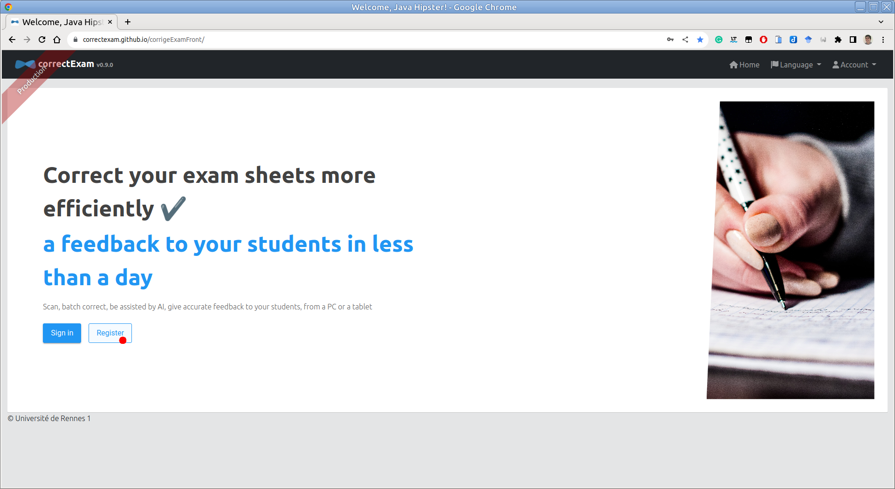
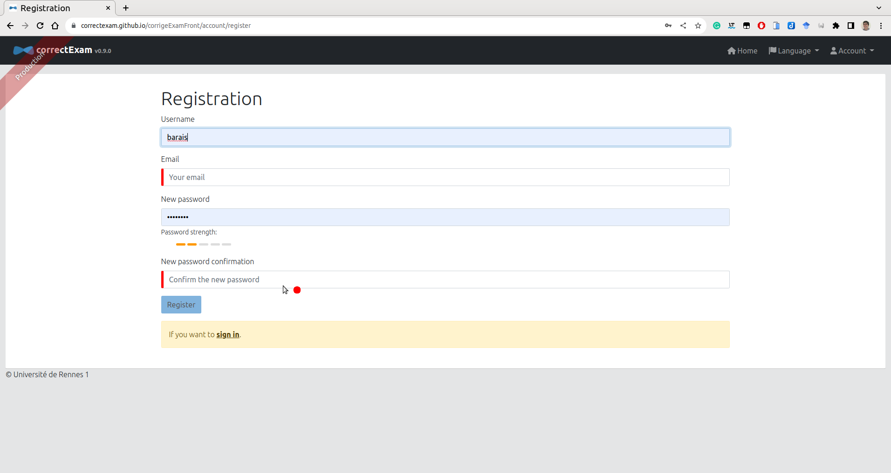
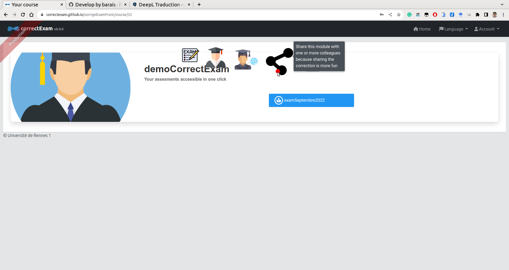
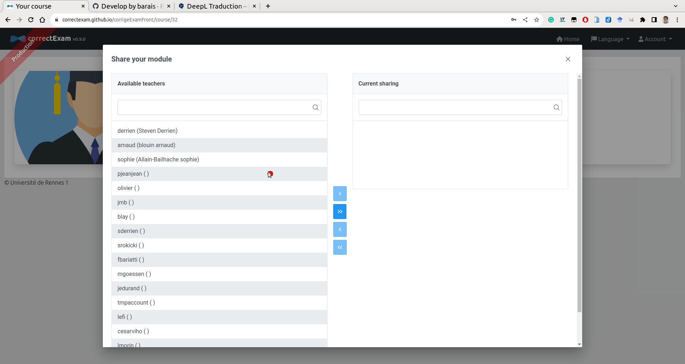
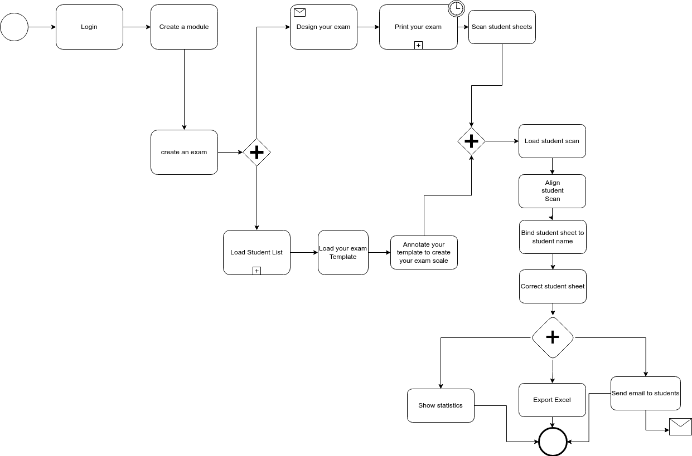

(user1)=
# Les grandes étapes d'une correction d'examen

Les grandes étapes d'une correction d'examens sont les suivantes:

0. Créer un compte sur la plateforme ?
1. Créer son cours et son examen (Cela comprend fabriquer l'énoncé de son examen à l'aide d'un traitement de texte (word, google doc, libreoffice) ou de latex ;) et charger la liste des étudiants qui peuvent composer
2. Créer son barème de correction (la façon dont chaque question sera évaluée, ses commentaires types par question, ...)
3. Charger les scans des copies des examens correctement ordonnés
4. Redresser ses scans
5. Associer chaque copie avec un étudiant (assistée à l'aide de l'IA)
6. Corriger ses copies (question par question ou étudiant par étudiant ou tout autre combinaison)
7. Regarder les statistiques associés à la réussite à l'examen pour potentiellement ajuster un peu la barème
8. Envoyer le retour aux étudiants
9. Exporter les notes aux formats Excel pour une transmission à la scolarité

Une vidéo de démonstration est accessible [ici](https://www.youtube.com/watch?v=bYTBlTg37RM&t)

## Étape 0: Comment créer un compte sur la plateforme ?

Vous pouvez vous rendre sur la [plateforme](https://correctexam.github.io/corrigeExamFront/), cliquer sur **s'inscrire**, remplir quelques informations. Vous recevrez un e-mail pour valider votre compte.

Vous pouvez ensuite remplir les informations relatives à votre compte dans le menu. *Compte* -> *Réglages*

## Étape 1: Créer son cours et son examen (Cela comprend fabriquer l'énoncé de son examen à l'aide d'un traitement de texte (word, google doc, libreoffice) ou de latex ;)

Une fois authentifié, sur la page d'accueil, cliquez sur le symbole **+** *créer un cours*.
Il est nécessaire de donner un nom au cours.

Si vous souhaitez corriger à plusieurs, lorsque vous cliquez sur le module, vous avez accès dans la liste des actions à une action partagée qui vous permet de partager ce module avec un ou plusieurs collègues. Ces derniers verront alors ce module dans la liste de leurs modules.

Pour créer un examen, une fois entré dans la page d'un module, il est possible de créer un nouvel examen avec la commande (+) ou importer un examen existant. Dans la vue qui vous permet de créer un examen, vous avez accès à un certain nombre de modèles pour créer votre examen. La philosophie de l'application est de permettre à chaque enseignant de créer son examen avec l'outil qui lui convient.

Il est ensuite nécessaire de charger la liste des étudiants de ce module. Pour corriger, nous associons chaque clé de réponse à un étudiant. Cette liste est nécessaire pour effectuer la tâche d'affectation. (Au pire si vous ne voulez aucun , nom vous pouvez toujours associé avec des numéros entrés sur la copie et une liste d'étudiants avec comme nom *étudiant1/étudiant2, ...*)

:::{note}
Pour Rennes, cette liste est accessible ici : https://mdw.univ-rennes1.fr/
:::

## Étape 2: Créer son barème de correction (la façon dont chaque question sera évaluée, ses commentaires types par question, ...)

Pour créer son barème, une fois entré dans la page d'un module, puis de l'examen en question, vous avez accès à un bouton annoter template. C'est ici que vous définissez l'ensemble des zones d'intérêt mais aussi le barème de chaque question. 
Il faut des zones d'intérêt avec le nom, le prénom et/ou le numéro étudiant. 
Il faut aussi des zones d'intérêt qui définissent les zones où l'étudiant va répondre pour chacune des questions qui lui sont posées. 

### Comprendre les différents types de question

Pour l'instant, il y a grosso modo quatre types de question. 

- Les questions dites directes. La notation **DIRECTE** (*Manuelle et Directe*) pour laquelle l'enseignant note manuellement les réponses à cette question en affectant une note à chaque étudiant pour cette question. 
- Les questions dites positives. La notation **POSITIVE** (*manuelle et POSITIVE*). Il s'agit d'un élément pour lequel l'enseignant peut définir un ensemble de commentaires en cours de route qui donne des points aux réponses à cette question (on part de zéro). Le nombre total de points obtenus ne peut dépasser le nombre maximum de points associés à cette question.
- Les questions dites négatives. La notation **NEGATIVE** (*Manuel et NEGATIVE*). Il s'agit d'un élément pour lequel le correcteur peut définir un ensemble de commentaires en cours de route qui enlève des points à la réponse en question (on part du nombre de points maximum possible pour cette question). Le nombre total de points obtenus ne peut être inférieur à zéro.
- Les **QCM** pour lesquelles l'application fournit une aide à la notation. 

:::{note}
Les commentaires associés à une question peuvent être définis ici ou en cours de correction dans la vue correction. 
:::
 
### Fonctionnement du barème selon les types de question

Pour chaque question, il faudra définir le numéro de la question, le nombre de point total et une notion de *pas*. Le numéro de la question peut être le même pour plusieurs questions (si par exemple la zone de réponse est située sur deux pages distinctes). Le nombre de point correspond à la note maximale pour cette question. La notion de *pas* définit l'incrément possible par point. 

- Par exemple,  une réponse à une question de type **DIRECTE** sur deux points avec un pas de 4 pourra être notée de 0,25 en 0,25. c'est à dire qu'il sera possible de mettre 0 ; 0,25 ; 0,5 ; ... ; 1,75 ou 2. 

- Par exemple, une réponse à une question de type **POSITIVE** sur deux points avec un pas de 4 permettra de définir des commentaires qui ajouteront des points qui pourront valoir 0 ; 0,25 ; 0,5 ; ... ; 1,75 ou 2. Sachant que même si deux commentaires positifs donnent une note totale supérieur à 2, la note sera ramenée à 2, la valeur maximale pour la question.
- Par exemple, une réponse à une question de type **NEGATIVE** sur deux points avec un pas de 4 permettra de définir des commentaires qui enlèveront des points qui pourront valoir 0 ; -0,25 ; -0,5 ; ... ; -1,75 ou -2. Sachant que même si deux commentaires négatifs donnent une note totale inférieur à 0, la note sera ramenée à 0, la valeur minimale pour la question. Si aucun commentaire négatif n'est appliqué, l'étudiant a la note maximale pour cette question à savoir dans notre exemple 2. 
- Par exemple, pour une réponse à une question de type **QCM**, il sera nécessaire de donner l'ensemble des réponses valides. Si la réponse de l'étudiant est valide il aura la note maximale a la question. Si la réponse n'est pas valide, il aura pour le moment la pénalité qui est définie au moment du barème comme - 1/10 ; - 1/8 ; - 1/6 ; ... ; -1/2 ; -1 ou 0 * la note maximale. Si l'étudiant a laissé vide, il aura 0 à la question. Donc si vous mettez le nombre de point à 2, la pénalité à 1/4. Si l'étudiant a bon il a 2 points, si il a faux il a -0,5, si il n'a pas répondu il a 0. 

## Étape 3: Charger les scans des copies des examens correctement ordonnés

L'étape suivante est de charger les copies étudiantes dans l'application. Nous recommandons d'utiliser des niveaux de gris à 150 DPI pour que la taille du fichier reste raisonnable, mais il n'y a pas de problème pour un scan en couleur à 300 DPI si nécessaire. Évitez le noir et blanc pur qui pourrait nuire à l'algorithme qui reconnaît les noms/prénoms/identifiants (INE) des étudiants à l'étape suivante.

:::{attention}
Le scan doit arriver en **UN SEUL FICHIER pdf**. Il doit être **propre**, c'est à dire pas de page(s) manquante(s), pas de page(s) dans le mauvais ordre. L'application ne fournit par de mécanisme pour améliorer les scans après import.
:::

Utilisez [pdfarranger](https://github.com/pdfarranger/pdfarranger). C'est un excellent outil pour cette tâche de nettoyage des scans étudiants.

:::{tip}
Agrafer les copies étudiantes avant que ces derniers ne composent. Demandez leur de ne pas enlever les agrafes. Utiliser un massicot pour retirer les agrafes avant de scanner vos copies. 
:::

## Étape 4. Redresser ses scans

Il faut maintenant faire tourner le traitement qui aligne les images pour gommer les déformations liées au scan des copies. Si vous avez des marques (ronds noirs) aux quatre coins des copies, utilisez l'alignement avec marque, sinon sans marque ce sera plus long. Si vous n'avez pas de QCM et que votre scanner déforme peu les copies, vous pouvez aussi ne pas redresser les copies. 

Vous pouvez demander à réaligner uniquement une partie des copies en sélectionnant les pages à réaligner. Cela permet de voir en particulier à partir de quel point il a fait son alignement. C'est parfois utile pour comprendre pourquoi l'alignement se passe mal. 

## Étape 5: Associer chaque copie avec un étudiant (assistée à l'aide de l'IA)

L'étape suivante consiste à associer chaque copie avec un étudiant de la liste des étudiants. Il est possible de filtrer les étudiant(e)s déjà affecté(e)s à une copie. 

À la fin de cette étape, si vous avez bien affecté l'ensemble des copies alors vous pouvez passer à la phase de correction. Sinon c'est probablement parcequ'une copie n'a pas encore été affectée. 

## Étape 6: Corriger ses copies (question par question ou étudiant par étudiant ou tout autre combinaison)

On entre maintenant dans la phase de correction. Sur le même équipement ou sur un autre équipement (une tablette par exemple), vous pouvez corriger les copies (question par question ou étudiant par étudiant). Vous pouvez annoter l'image à l'aide d'un crayon, mettre des commentaires, mettre une note, corrigé automatiquement les QCMs, ...

Un tableau de bord vous permet de voir l'avancement de la correction. 

Si vous corrigez sur ordinateur et pas sur tablette, il existe des raccourcis clavier pour naviguer efficacement, il est aussi possible de définir ses propres raccourcis clavier pour appliquer ou enlever des commentaires prédéfinis. Un appui sur la touche *F1* permet de revoir les raccourcis clavier existants. 

Lors de cette phase, il est intéressant de taguer les réponses dites excellentes et les mauvaises réponses remarquables. Cela permet de créer un corrigé automatiquement pour les étudiants et cela permet de discuter avec les étudiants plus tard ces mauvaises réponses remarquables de manières anonymes.

## Étape 7: Regarder les statistiques associées à la réussite à l'examen pour potentiellement ajuster un peu le barème

En cours de correction ou à la fin de la correction, en passant par la vue **voir résultats**, il est possible de visualiser les statistiques associées à cet examen afin d'ajuster le barème en modifiant par exemple la valeur associé aux commentaires pour les notations **POSITIVE** ou **NEGATIVE** Pour la notation **DIRECTE**, il ne sera pas possible de modifier le barème après la correction et il sera donc nécessaire de repasser sur l'ensemble des copies si l'on souhaite changer le barème.

## Étape 8: Envoyer le retour aux étudiants

Une fois la correction correcte,  en passant par la vue **voir résultats**, il est possible de communiquer les copies aux étudiants. Ces derniers récupéreront un lien unique pour consulter leur copie et pourront voir les réponses taguées excellentes de manière anonymes. Le mail d'envoi est paramétrable juste avant l'envoi. 

:::{warning}
Si vous avez corrigé, les copies non pas sur l'instance en ligne, mais sur une instance installée sur votre propre machine. Vous devrez exporter le module et le réimporté sur la plateforme principale ou celle de votre établissement pour que l'envoi de mails fonctionne correctement. 
:::

:::{note}
Cette étape de transmission aux étudiants n'est pas obligatoire. C'est la motivation première de l'outil, mais l'outil peut juste servir à évaluer sans chercher à faire un retour systématique aux étudiants. 
:::

## Étape 9: Export les notes aux formats Excel pour une transmission à la scolarité

Enfin, il est possible d'exporter les notes au format Excel pour les transmettre vers la scolarité. 

# Foire aux questions pour les utilisateurs

## Comment créer un nouveau cours/unité d'enseignement ?

Une fois authentifié, sur la page d'accueil, cliquez sur le symbole **+** *créer un cours*.
Il est nécessaire de donner un nom au cours.

## Puis-je partager une correction avec un ou plusieurs collègues ?

Lorsque vous cliquez sur le module, vous avez accès dans la liste des actions à une action partagée qui vous permet de partager ce module avec un ou plusieurs collègues. Ces derniers verront alors ce module dans la liste de leurs modules.

## Puis-je limiter les droits d'un collègue afin qu'il ne puisse accéder qu'à un sous-ensemble de questions ?

Non, un collègue, nous pouvons lui faire confiance ;). Nous n'implémentons pas de règles RBAC spécifiques par examen pour le moment.

## Avez-vous un diagramme des principales étapes à suivre pour utiliser cette application ?

## Comment créer un examen ?

Pour créer un examen, une fois entré dans la page d'un module, il est possible de créer un nouvel examen avec la commande (+) ou importer un examen existant. 

## Où puis-je trouver des modèles pour Word latex et libreoffice ?

Dans la vue qui vous permet de créer un examen, vous avez accès à un certain nombre de modèles pour créer votre examen. La philosophie de l'application est de permettre à chaque enseignant de créer son examen avec l'outil qui lui convient.

## Pourquoi suis-je obligé de télécharger une liste d'élèves ?

Pour corriger, nous associons chaque clé de réponse à un étudiant. Cette liste est nécessaire pour effectuer la tâche d'affectation. (Au pire si vous voulez aucun , nom vous pouvez toujours associé avec des numéros entrés sur la copie et une liste d'étudiant avec comme nom étudiant1/étudiant2, ...)

## Dois-je supprimer un étudiant qui n'a pas composé ? 

Non, il sera marqué comme ABI par défaut. 

## Pouvez-vous expliquer les différents types de question disponibles ?

Pour l'instant, il y a grosso modo quatre types de questions. 

- Les **QCM** pour lesquelles l'application fournit une aide à la notation. 
- La notation **DIRECTE** (*Manuelle et Directe*) pour laquelle l'enseignant note manuellement les réponses à cette question. 
- La notation **POSITIVE** (*manuelle et POSITIVE*). Il s'agit d'un élément pour lequel l'enseignant peut définir un ensemble de commentaires en cours de route qui donne des points aux réponses à cette question (on part de zéro). Le nombre total de points obtenus ne peut dépasser le nombre maximum de points associés à cette question.
- La notation **NEGATIVE** (*Manuel et NEGATIVE*). Il s'agit d'un élément pour lequel le correcteur peut définir un ensemble de commentaires en cours de route qui enlève des points à la réponse en question (on part du nombre de points maximum possible pour cette question). Le nombre total de points obtenus ne peut être inférieur à zéro.

Ce type de question sera enrichi à l'avenir. N'hésitez pas à nous faire part de vos bonnes idées.

## Puis-je changer le type de question lorsque la correction d'une question a commencé ?

Honnêtement, ce n'est pas recommandé car pas assez testé.

## Comment nettoyer le scan des élèves s'il manque des pages, s'il y a des doublons, s'il y a des pages retournées... ?

Utilisez [pdfarranger](https://github.com/pdfarranger/pdfarranger). C'est un excellent outil pour cette tâche.

## Puis-je recharger un scan propre (voir question précédente) et le réaligner si j'ai déjà commencé à corriger un examen ?

Oui, pas de problème, si vous partagez la correction avec des collègues ou avec différents appareils, vous pouvez forcer le chargement et le téléchargement vers le serveur plus tard. 

## Que se passe-t-il si mon modèle a un nombre impair de pages (*e.g.* 3 pages) et que le scan des feuilles des étudiants est un multiple de 2 (*e.g.* 4 pages par étudiant) ?

Pour l'instant, cela ne se gère pas correctement au moment de l'alignement. Il sera nécessaire de supprimer les pages blanches des scans des élèves au préalable avec des outils de manipulation de pdf comme [pdftk](https://www.pdflabs.com/tools/pdftk-the-pdf-toolkit/) ou [pdfarranger](https://github.com/pdfarranger/pdfarranger).

## Comment puis-je numériser les feuilles des élèves ?

Nous recommandons d'utiliser des niveaux de gris à 150 DPI pour que la taille du fichier reste raisonnable, mais il n'y a pas de problème pour un scan en couleur à 300 DPI si nécessaire. Évitez le noir et blanc pur qui pourrait nuire à l'algorithme qui reconnaît les noms/prénoms/identifiants (INE) des étudiants.

## Puis-je rédiger un énoncé d'examen avec un autre outil que word, libreoffice ou latex ?

Bien sûr, le seul point important est un marqueur circulaire dans les coins pour faciliter l'alignement et des carrés gris clair pour mettre les noms, prénoms et identifiants (INE) des étudiants. 

## Que faire lorsque je rencontre un bug dans l'application ?

Utilisez le système de ticket github sur le projet https://github.com/correctexam/corrigeExamFront

## Puis je installer sur mon ordinateur la solution pour éviter d'utiliser la version en ligne et corriger hors ligne (dans le train par example)

Nous fournissons des [releases packagés](https://github.com/correctexam/corrigeExamBack/releases) pour fonctionner sur les trois systèmes d'exploitation (windows, macos, linux) pour les architecture AMD64 muni d'une base de données intégré. 

Sous linux et macos, vous pouvez juste télécharger le binaire pour votre os, rendre se binaire exécutable, lancer l'application et aller sur votre navigateur à l'adresse http://localhost:8080 (utilisateur par défaut user/user ou admin/admin).

Sous windows, il sera nécessaire de télécharger l'exécutable mais aussi les deux fichiers *mydb...* correspondant à la base de données. Placer ces trois fichiers dans le même répertoire et lancer l'exécutable.  Aller sur votre navigateur à l'adresse http://localhost:8080 (utilisateur par défaut user/user ou admin/admin).

:::{note}
Les données du projet peuvent ensuite être exporté puis importé sur la plateforme en ligne, entres autres si vous souhaité testé l'envoi de mail aux étudiants.
:::

## Puis je détruire mes données sur la plate-forme

Oui à tout moment, nous vous conseillons de faire un backup (cours par cours) si vous souhaitez un jour réutiliser certaines données. Quand vous détruisez vos données, aucun backup n'est conservé donc nous ne pourrons restituer les données. 

## Quelles garanties j'ai de ne pas perdre de données en cas de problème sur la plateforme 

Pour le moment, la plateforme accessible en ligne https://correctexam.github.io/corrigeExamFront/ est proposé en mode *best effort* sur un serveur de l'Université de Rennes 1. Aucune garantie sur les données n'est fournie. Nous vous invitons à vous rapprocher du service informatique de votre établissement si vous souhaitez un meilleur niveau de garantie

